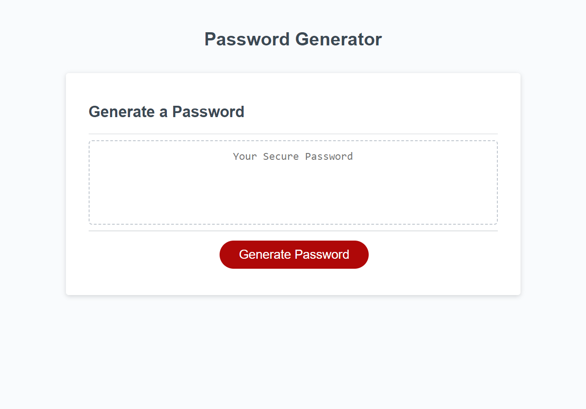

# Password Generator
 
## Description

The third weekly challenge is to use the starter code provided to us and write the javascript portion of it to make it generate a random password. To meet the goal of the challenge we need to write code that that creates prompts that ask the user to select if they would like to make a password, how many characters that password will be, and then a series of prompts that defines what characters that password will consist of. When the user finishes the series of prompts than it will output a random password based on their choices.

## Links 

Link to live url: https://samualjensen.github.io/password-generator-js/

Link to repository: https://github.com/Samualjensen/password-generator-js

## Installation

Upload index.html, license.txt, and assets folder to the deployed webserver. The develop folder in the repository contains images for the webage, javascript files, and CSS files. The live url included above was provided using GitHub Pages.

## Webapge Image

## Credits 

Starter code was provided by Xandromus through Github and given to us though the Bootcamp spot. Some additional guidence and help was provided by the #askbcs learning assistant through slack.

## License

